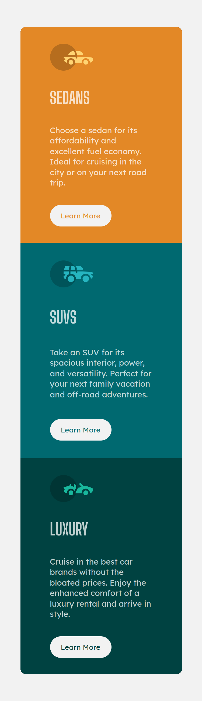

## Table of contents

- [Overview](#overview)
  - [The challenge](#the-challenge)
  - [Screenshot](#screenshot)
  - [Links](#links)

## Overview

### The challenge

Cloned the given three column card using basic html and css, and made the application respovise for mobile and system screens.

### Screenshot

**Note: Delete this note and the paragraphs above when you add your screenshot. If you prefer not to add a screenshot, feel free to remove this entire section.**

### Links

- Solution URL: [solution](https://github.com/palavarapuprakash44/ThreeColumnCard)
- Live Site URL: [live site URL here](https://palavarapuprakash44.github.io/ThreeColumnCard/)
